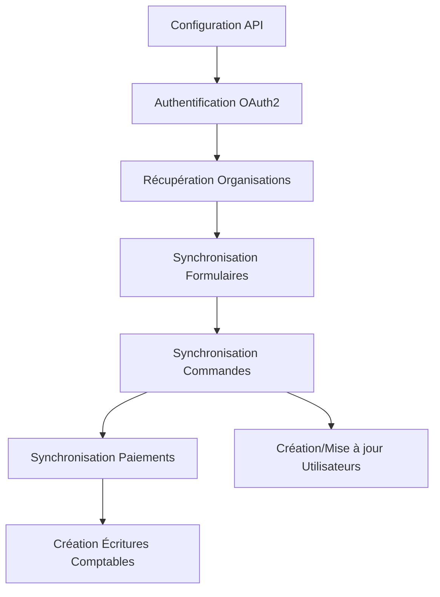

# Plugin HelloAsso pour Paheko

> **Intégration HelloAsso - Paheko** | Version : 1.0.0 | Auteur : [Paheko](https://paheko.cloud/)

---

## 📋 Présentation Générale

Ce plugin permet la **synchronisation entre HelloAsso et Paheko** pour :

- Visualiser les paiements effectués sur HelloAsso
- Synchroniser les adhésions et les transformer en membres Paheko
- **Aucune modification** n'est apportée au compte HelloAsso (mode lecture seule)

**📖 Documentation officielle** : [paheko.cloud/extension-helloasso](https://paheko.cloud/extension-helloasso)

---

## 🎯 Fonctionnalités Principales

### 1. Synchronisation des Données

| Type | Description | Synchronisation |
|------|-------------|----------------|
| **Formulaires** | Récupération des campagnes HelloAsso (adhésions, événements, dons, etc.) | ✅ Automatique |
| **Commandes** | Import des commandes et paiements associés | ✅ Automatique |
| **Paiements** | Récupération des transactions financières | ✅ Automatique/Manuelle |
| **Adhésions** | Transformation des adhésions en membres Paheko | ✅ Configurable |

### 2. Gestion des Organisations

- Support multi-organisations HelloAsso
- Configuration séparée par organisation
- Mode **sandbox** pour les tests

### 3. Mapping des Champs

- Correspondance configurable entre les champs HelloAsso et Paheko
- Gestion des noms (Prénom + Nom ou Nom + Prénom)
- Mapping des adresses, codes postaux, villes, etc.

### 4. Intégration Comptable

- Association des paiements à des comptes comptables Paheko
- Création automatique d'écritures comptables
- Gestion des exercices comptables

### 5. Gestion des Utilisateurs

- Création automatique des utilisateurs Paheko depuis les payeurs HelloAsso
- Recherche et association des utilisateurs existants
- 3 modes de gestion :
  - **`NO_USER_ACTION`** (0) : Aucune action
  - **`CREATE_UPDATE_USER`** (1) : Créer/mettre à jour
  - **`UPDATE_USER`** (2) : Mise à jour uniquement

---

## 🏗️ Architecture Technique

### Structure des Fichiers

```
helloasso/
├── plugin.ini              # Métadonnées du plugin
├── schema.sql              # Schéma de la base de données
├── uninstall.sql           # Script de désinstallation
├── install.php             # Script d'installation
├── upgrade.php             # Script de mise à jour
├── admin/                  # Interface d'administration
│   ├── _inc.php            # Initialisation commune
│   ├── config.php          # Configuration générale
│   ├── config_client.php   # Configuration des clés API
│   ├── config_accounting.php # Configuration comptable
│   ├── form.php            # Gestion des formulaires
│   ├── form_option.php      # Gestion des options
│   ├── form_tier.php        # Gestion des paliers
│   ├── index.php           # Liste des campagnes
│   ├── items.php           # Liste des articles
│   ├── order.php           # Détail d'une commande
│   ├── orders.php           # Liste des commandes
│   ├── payments.php         # Liste des paiements
│   └── sync.php             # Synchronisation
├── lib/                    # Bibliothèques PHP
│   ├── API.php              # Client API HelloAsso
│   ├── HelloAsso.php        # Classe principale du plugin
│   ├── Forms.php            # Gestion des formulaires
│   ├── Orders.php           # Gestion des commandes
│   ├── Items.php            # Gestion des articles
│   ├── Payments.php         # Gestion des paiements
│   └── Entities/            # Entités de la base de données
│       ├── Form.php
│       ├── Item.php
│       ├── Option.php
│       ├── Order.php
│       ├── Payment.php
│       └── Tier.php
└── templates/              # Vues (Smarty templates)
    ├── _menu.tpl
    ├── config.tpl
    ├── form.tpl
    ├── index.tpl
    ├── order.tpl
    ├── sync.tpl
    └── ...
```

### Base de Données

Le plugin crée 7 tables dans la base de données Paheko :

| Table | Description | Relations |
|-------|-------------|-----------|
| **`plugin_helloasso_forms`** | Formulaires HelloAsso | `id_year` → `acc_years` |
| **`plugin_helloasso_forms_tiers`** | Paliers de tarification | `id_form` → `forms`, `id_fee` → `services_fees` |
| **`plugin_helloasso_forms_options`** | Options des formulaires | `id_form` → `forms` |
| **`plugin_helloasso_forms_tiers_options_links`** | Liens entre paliers et options | `id_tier`, `id_option` |
| **`plugin_helloasso_orders`** | Commandes | `id_form`, `id_user`, `id_transaction` |
| **`plugin_helloasso_items`** | Articles/éléments de commande | `id_form`, `id_order`, `id_tier`, `id_user`, `id_subscription` |
| **`plugin_helloasso_payments`** | Paiements | `id_form`, `id_order`, `id_user` |

---

## 🎨 Design & Intégration

### Design Patterns Utilisés

| Pattern | Implémentation | Localisation |
|---------|----------------|--------------|
| **Singleton** | Gestion unique des instances API et HelloAsso | `API.php`, `HelloAsso.php` |
| **Entity-Manager** | Gestion des entités base de données | `Entities/*` + KD2 |
| **Factory** | Création d'entités | `getOrCreateTier()`, `getOption()` |
| **Repository** | Accès aux données | `Forms::get()`, `Orders::list()` |

### Intégration avec Paheko

- **Système de plugins natif** : Utilisation de `Plugins::get()` et `Plugin::class`
- **Système de templates** : Utilisation de Smarty pour les vues
- **Gestion des droits** : `restrict_section="users"`, `restrict_level="write"`
- **Intégration comptable** : Liaison avec `acc_years`, `services_fees`, `acc_transactions`
- **Système de configuration** : Stockage dans `plugins` table via `getConfig()`/`setConfigProperty()`

### API HelloAsso

| Endpoint | Méthode | Description |
|---------|---------|-------------|
| `/oauth2/token` | POST | Authentification OAuth2 |
| `/v5/users/me/organizations` | GET | Liste des organisations |
| `/v5/organizations/{org}/forms` | GET | Liste des formulaires |
| `/v5/organizations/{org}/forms/{type}/{slug}/public` | GET | Détail d'un formulaire |
| `/v5/organizations/{org}/orders` | GET | Liste des commandes |
| `/v5/organizations/{org}/payments` | GET | Liste des paiements |
| `/v5/organizations/{org}/items` | GET | Liste des articles |

**URLs** :
- Production : `https://api.helloasso.com/`
- Sandbox : `https://api.helloasso-sandbox.com/`

---

## 🔧 Configuration

### Configuration Requise

1. **Clés API HelloAsso** :
   - `client_id` : Identifiant client HelloAsso
   - `client_secret` : Secret client HelloAsso
   - `sandbox` : Mode sandbox (true/false)

2. **Mapping des champs** :
   - `fields_map` : Correspondance entre champs HelloAsso et Paheko
   - `merge_names_order` : 0 = Prénom Nom, 1 = Nom Prénom
   - `match_email_field` : Utiliser l'email comme identifiant (true/false)

3. **Comptes comptables** :
   - `bank_account_code` : Compte bancaire
   - `provider_account_code` : Compte fournisseur
   - `donation_account_code` : Compte dons
   - `payment_account_code` : Compte paiements

### Exemple de Configuration

```ini
; plugin.ini
name="HelloAsso"
description="Pour voir et synchroniser les paiements effectués sur HelloAsso"
author="Paheko"
version="1.0.0"
min_version="1.3.19"
restrict_section="users"
restrict_level="write"
```

---

## ⚙️ Workflow Typique

### 1. Configuration Initiale

1. Installer le plugin via l'interface Paheko
2. Configurer les clés API HelloAsso (`client_id`, `client_secret`)
3. Choisir le mode (production/sandbox)
4. Sauvegarder → Redirection vers la synchronisation

### 2. Première Synchronisation



### 3. Gestion des Adhésions

1. Lorsqu'un paiement HelloAsso est synchronisé
2. Le plugin vérifie si un utilisateur existe déjà (par email ou nom)
3. Si `create_payer_user` est activé sur le palier :
   - Création d'un nouvel utilisateur Paheko
   - Mapping des données HelloAsso → champs Paheko
4. Association de l'adhésion à un service Paheko (si configuré)

### 4. Intégration Comptable

1. Chaque paiement peut être associé à un compte comptable
2. Création automatique d'une écriture (`acc_transactions`)
3. Association à un exercice comptable (`acc_years`)

---

## 📊 Types de Formulaires Supportés

| Type | Description | Constante |
|------|-------------|-----------|
| CrowdFunding | Finance participative | `CrowdFunding` |
| Membership | Adhésions | `Membership` |
| Event | Billetteries | `Event` |
| Donation | Dons | `Donation` |
| PaymentForm | FlexiPaiement | `PaymentForm` |
| Checkout | Encaissement | `Checkout` |
| Shop | Boutique | `Shop` |

---

## 📊 États des Formulaires

| État | Description | Couleur |
|------|-------------|--------|
| Draft | Brouillon | Gris |
| Public | Public | Vert |
| Private | Privé | Rouge |
| Disabled | Désactivé | Noir |

---

## 🔧 Constantes Importantes

```php
// Dans HelloAsso.php
const PER_PAGE = 100;                    // Nombre d'éléments par page API
const NO_USER_ACTION = 0;                // Aucune action utilisateur
const CREATE_UPDATE_USER = 1;            // Créer/mettre à jour
const UPDATE_USER = 2;                  // Mise à jour uniquement
const MERGE_NAMES_FIRST_LAST = 0;        // Format "Prénom Nom"
const MERGE_NAMES_LAST_FIRST = 1;        // Format "Nom Prénom"

// Champs payeur
const PAYER_FIELDS = [
    'firstName'   => 'Prénom',
    'lastName'    => 'Nom',
    'email'       => 'Courriel',
    'address'     => 'Adresse postale',
    'city'        => 'Ville',
    'zipCode'     => 'Code postal',
    'country'     => 'Pays',
    'dateOfBirth' => 'Date de naissance',
    'company'     => 'Organisme'
];
```

---

## 📊 Exemples de Données

### Formulaire (plugin_helloasso_forms)

```json
{
  "id": 1,
  "org_name": "Mon Association",
  "org_slug": "mon-association",
  "name": "Adhésion 2024",
  "type": "Membership",
  "state": "Public",
  "slug": "adhesion-2024",
  "id_year": 1,
  "payment_account_code": "531",
  "create_payer_user": 1
}
```

### Commande (plugin_helloasso_orders)

```json
{
  "id": 12345,
  "id_form": 1,
  "id_user": 1,
  "id_transaction": 42,
  "date": "2024-01-15 10:30:00",
  "person": "Jean Dupont",
  "amount": 2000,
  "status": "Paid"
}
```

### Paiement (plugin_helloasso_payments)

```json
{
  "id": 67890,
  "id_form": 1,
  "id_order": 12345,
  "id_user": 1,
  "amount": 2000,
  "state": "Paid",
  "transfer_date": "2024-01-16",
  "date": "2024-01-15 10:30:00",
  "receipt_url": "https://helloasso.com/..."
}
```

---

## 🔐 Sécurité

- **Chiffrement des tokens** : `Security::encryptWithPassword()` / `Security::decryptWithPassword()`
- **CSRF Protection** : Utilisation de clés uniques par formulaire
- **Accès restreint** : Vérification des permissions (`requireAccess()`)
- **Token OAuth2** : Gestion du refresh token automatique

---

## 🎯 Points Forts

✅ **Intégration complète** avec l'API HelloAsso  
✅ **Synchronisation bidirectionnelle** (lecture HelloAsso → écriture Paheko)  
✅ **Flexibilité** : Configuration fine du mapping et des comportements  
✅ **Sécurité** : Chiffrement des tokens, protection CSRF  
✅ **Architecture propre** : Séparation des responsabilités (API, Entités, Synchronisation)  
✅ **Intégration native** avec le système de plugins Paheko

---

## ⚠️ Limitations

- **Lecture seule** sur HelloAsso (pas de modification des données source)
- Synchronisation des paiements désactivée par défaut (à activer dans le code)
- Dépendance à la bibliothèque KD2

---

## 💡 Améliorations Possibles

- Ajouter la synchronisation automatique planifiée (cron)
- Implémenter la synchronisation des paiements (actuellement commentée dans Orders.php)
- Ajouter plus d'options de mapping des champs
- Support des webhooks HelloAsso pour une synchronisation en temps réel

---

## 📚 Voir aussi

- [Documentation officielle Paheko](https://paheko.cloud/extension-helloasso)
- [API HelloAsso](https://api.helloasso.com/)
- [Repository Paheko](https://fossil.kd2.org/paheko/)

---

*Généré pour le projet Paheko - Plugin HelloAsso*